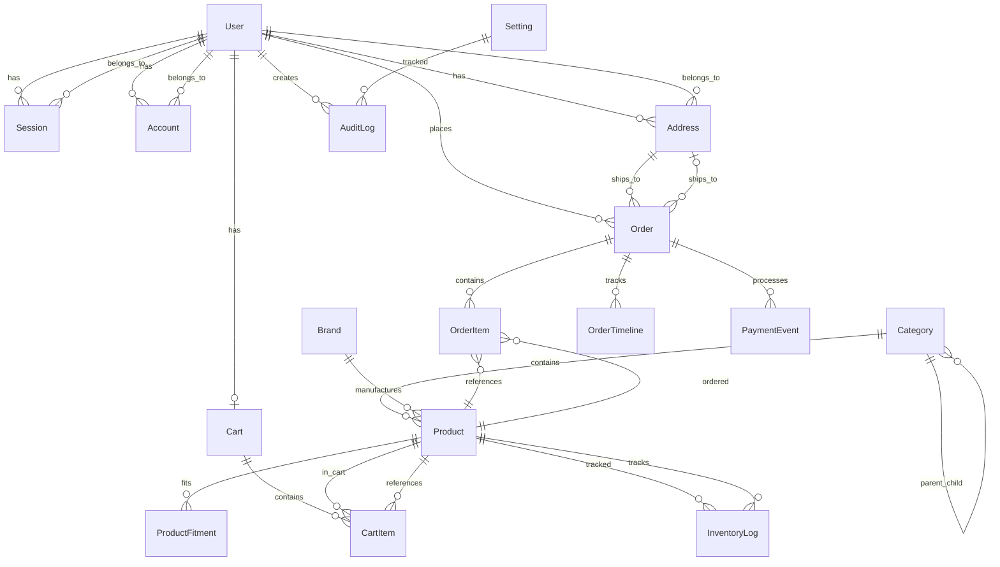

# 03. Database Schema Documentation

This document provides complete documentation of the SN Auto Parts database schema, including all tables, relationships, constraints, and enums.

## Database Overview

- **Database Type:** PostgreSQL
- **Provider:** Neon Cloud
- **ORM:** Prisma
- **Connection:** Via `DATABASE_URL` environment variable
- **Migrations:** Prisma Migrate

## Entity Relationship Diagram



## Enums

### UserRole

```prisma
enum UserRole {
  CUSTOMER
  MANAGER
  ADMIN
}
```

**Description:** Defines user roles in the system
- `CUSTOMER` - Regular shoppers (default)
- `MANAGER` - Operations staff with inventory and order management
- `ADMIN` - System administrators with full access

### OrderStatus

```prisma
enum OrderStatus {
  PENDING
  CONFIRMED
  PROCESSING
  SHIPPED
  DELIVERED
  CANCELLED
  REFUNDED
}
```

**Description:** Order lifecycle status
- `PENDING` - Order placed, awaiting payment confirmation
- `CONFIRMED` - Payment confirmed, order ready for processing
- `PROCESSING` - Order being prepared for shipment
- `SHIPPED` - Order shipped to customer
- `DELIVERED` - Order delivered to customer
- `CANCELLED` - Order cancelled
- `REFUNDED` - Order refunded

### PaymentStatus

```prisma
enum PaymentStatus {
  PENDING
  AUTHORIZED
  CAPTURED
  FAILED
  REFUNDED
  PARTIALLY_REFUNDED
}
```

**Description:** Payment processing status
- `PENDING` - Payment not yet processed
- `AUTHORIZED` - Payment authorized but not captured
- `CAPTURED` - Payment captured successfully
- `FAILED` - Payment failed
- `REFUNDED` - Payment fully refunded
- `PARTIALLY_REFUNDED` - Payment partially refunded

### InventoryAdjustmentType

```prisma
enum InventoryAdjustmentType {
  RECEIVED
  SOLD
  RETURNED
  DAMAGED
  ADJUSTMENT
  TRANSFER
}
```

**Description:** Types of inventory adjustments
- `RECEIVED` - New stock received
- `SOLD` - Stock sold (auto-created on order)
- `RETURNED` - Stock returned
- `DAMAGED` - Stock damaged or lost
- `ADJUSTMENT` - Manual correction
- `TRANSFER` - Stock transfer between locations

---

## Tables

### Auth & User Models

#### User

**Purpose:** Stores user account information

**Table Name:** `users`

| Field | Type | Constraints | Description |
|-------|------|-------------|-------------|
| id | String | Primary Key, CUID | Unique user identifier |
| email | String | Unique, Required | User email address |
| emailVerified | DateTime | Nullable | Email verification timestamp |
| name | String | Nullable | Full name |
| firstName | String | Nullable | First name |
| lastName | String | Nullable | Last name |
| phone | String | Nullable | Phone number |
| role | UserRole | Default: CUSTOMER | User role |
| image | String | Nullable | Profile image URL |
| createdAt | DateTime | Auto, Required | Account creation timestamp |
| updatedAt | DateTime | Auto, Required | Last update timestamp |

**Relationships:**
- One-to-many: `sessions`
- One-to-many: `accounts`
- One-to-many: `addresses`
- One-to-one: `cart`
- One-to-many: `orders`
- One-to-many: `auditLogs`

**Indexes:**
- Primary key on `id`
- Unique index on `email`

---

#### Session

**Purpose:** Stores user session tokens

**Table Name:** `sessions`

| Field | Type | Constraints | Description |
|-------|------|-------------|-------------|
| id | String | Primary Key, CUID | Session identifier |
| userId | String | Foreign Key, Required | User ID |
| token | String | Unique, Required | Session token |
| expiresAt | DateTime | Required | Token expiration |
| createdAt | DateTime | Auto, Required | Session creation timestamp |
| updatedAt | DateTime | Auto, Required | Last update timestamp |
| ipAddress | String | Nullable | IP address of session |
| userAgent | String | Nullable | User agent string |

**Relationships:**
- Many-to-one: `user` (User)

**Indexes:**
- Primary key on `id`
- Unique index on `token`
- Foreign key on `userId` → `users.id` (CASCADE DELETE)

---

#### Account

**Purpose:** Stores authentication credentials and OAuth accounts

**Table Name:** `accounts`

| Field | Type | Constraints | Description |
|-------|------|-------------|-------------|
| id | String | Primary Key, CUID | Account identifier |
| userId | String | Foreign Key, Required | User ID |
| accountId | String | Required | Provider account ID |
| providerId | String | Required | Provider name (e.g., 'credentials') |
| accessToken | String | Nullable | OAuth access token |
| refreshToken | String | Nullable | OAuth refresh token |
| accessTokenExpiresAt | DateTime | Nullable | Access token expiration |
| refreshTokenExpiresAt | DateTime | Nullable | Refresh token expiration |
| scope | String | Nullable | OAuth scope |
| password | String | Nullable | Hashed password (for credentials) |
| createdAt | DateTime | Auto, Required | Account creation timestamp |
| updatedAt | DateTime | Auto, Required | Last update timestamp |

**Relationships:**
- Many-to-one: `user` (User)

**Indexes:**
- Primary key on `id`
- Foreign key on `userId` → `users.id` (CASCADE DELETE)

---

#### Verification

**Purpose:** Stores email verification and password reset tokens

**Table Name:** `verifications`

| Field | Type | Constraints | Description |
|-------|------|-------------|-------------|
| id | String | Primary Key, CUID | Verification identifier |
| identifier | String | Required | Email or identifier |
| value | String | Required | Verification token |
| expiresAt | DateTime | Required | Token expiration |
| createdAt | DateTime | Auto, Required | Token creation timestamp |
| updatedAt | DateTime | Auto, Required | Last update timestamp |

**Indexes:**
- Primary key on `id`

---

#### Address

**Purpose:** Stores user shipping addresses

**Table Name:** `addresses`

| Field | Type | Constraints | Description |
|-------|------|-------------|-------------|
| id | String | Primary Key, CUID | Address identifier |
| userId | String | Foreign Key, Required | User ID |
| label | String | Nullable | Address label (e.g., "Home", "Work") |
| firstName | String | Required | First name |
| lastName | String | Required | Last name |
| street | String | Required | Street address |
| apartment | String | Nullable | Apartment/Unit number |
| city | String | Required | City |
| state | String | Required | State/Province |
| zipCode | String | Required | ZIP/Postal code |
| country | String | Default: "US" | Country code |
| phone | String | Nullable | Phone number |
| isDefault | Boolean | Default: false | Default address flag |
| createdAt | DateTime | Auto, Required | Address creation timestamp |
| updatedAt | DateTime | Auto, Required | Last update timestamp |

**Relationships:**
- Many-to-one: `user` (User)
- One-to-many: `orders`

**Indexes:**
- Primary key on `id`
- Foreign key on `userId` → `users.id` (CASCADE DELETE)

---

### Catalog Models

#### Category

**Purpose:** Product categories with hierarchical support

**Table Name:** `categories`

| Field | Type | Constraints | Description |
|-------|------|-------------|-------------|
| id | String | Primary Key, CUID | Category identifier |
| name | String | Required | Category name |
| slug | String | Unique, Required | URL-friendly identifier |
| description | String | Nullable | Category description |
| imageUrl | String | Nullable | Category image URL |
| parentId | String | Foreign Key, Nullable | Parent category ID |
| sortOrder | Int | Default: 0 | Display sort order |
| isActive | Boolean | Default: true | Active status |
| createdAt | DateTime | Auto, Required | Category creation timestamp |
| updatedAt | DateTime | Auto, Required | Last update timestamp |

**Relationships:**
- Many-to-one: `parent` (Category, self-referential)
- One-to-many: `children` (Category, self-referential)
- One-to-many: `products`

**Indexes:**
- Primary key on `id`
- Unique index on `slug`
- Foreign key on `parentId` → `categories.id`

---

#### Brand

**Purpose:** Product brands/manufacturers

**Table Name:** `brands`

| Field | Type | Constraints | Description |
|-------|------|-------------|-------------|
| id | String | Primary Key, CUID | Brand identifier |
| name | String | Required | Brand name |
| slug | String | Unique, Required | URL-friendly identifier |
| logoUrl | String | Nullable | Brand logo URL |
| description | String | Nullable | Brand description |
| isActive | Boolean | Default: true | Active status |
| createdAt | DateTime | Auto, Required | Brand creation timestamp |
| updatedAt | DateTime | Auto, Required | Last update timestamp |

**Relationships:**
- One-to-many: `products`

**Indexes:**
- Primary key on `id`
- Unique index on `slug`

---

#### Product

**Purpose:** Product catalog items

**Table Name:** `products`

| Field | Type | Constraints | Description |
|-------|------|-------------|-------------|
| id | String | Primary Key, CUID | Product identifier |
| sku | String | Unique, Required | Stock Keeping Unit |
| name | String | Required | Product name |
| slug | String | Unique, Required | URL-friendly identifier |
| description | String | Nullable | Full description |
| shortDescription | String | Nullable | Short description |
| price | Decimal(10,2) | Required | Product price |
| compareAtPrice | Decimal(10,2) | Nullable | Compare at price (MSRP) |
| costPrice | Decimal(10,2) | Nullable | Cost price |
| categoryId | String | Foreign Key, Required | Category ID |
| brandId | String | Foreign Key, Nullable | Brand ID |
| imageUrl | String | Nullable | Primary image URL |
| images | String[] | Array | Additional image URLs |
| weight | Decimal(8,2) | Nullable | Product weight |
| weightUnit | String | Default: "lb" | Weight unit |
| stockQuantity | Int | Default: 0 | Current stock quantity |
| lowStockThreshold | Int | Default: 10 | Low stock alert threshold |
| isActive | Boolean | Default: true | Active status |
| isFeatured | Boolean | Default: false | Featured product flag |
| metaTitle | String | Nullable | SEO meta title |
| metaDescription | String | Nullable | SEO meta description |
| createdAt | DateTime | Auto, Required | Product creation timestamp |
| updatedAt | DateTime | Auto, Required | Last update timestamp |

**Relationships:**
- Many-to-one: `category` (Category)
- Many-to-one: `brand` (Brand, nullable)
- One-to-many: `cartItems`
- One-to-many: `orderItems`
- One-to-many: `fitments`
- One-to-many: `inventoryLogs`

**Indexes:**
- Primary key on `id`
- Unique index on `sku`
- Unique index on `slug`
- Index on `categoryId`
- Index on `brandId`

---

#### ProductFitment

**Purpose:** Vehicle fitment information (Year/Make/Model matching)

**Table Name:** `product_fitments`

| Field | Type | Constraints | Description |
|-------|------|-------------|-------------|
| id | String | Primary Key, CUID | Fitment identifier |
| productId | String | Foreign Key, Required | Product ID |
| yearStart | Int | Required | Start year |
| yearEnd | Int | Required | End year |
| make | String | Required | Vehicle make |
| model | String | Required | Vehicle model |
| submodel | String | Nullable | Vehicle submodel |
| engine | String | Nullable | Engine specification |
| notes | String | Nullable | Additional notes |
| createdAt | DateTime | Auto, Required | Fitment creation timestamp |

**Relationships:**
- Many-to-one: `product` (Product)

**Indexes:**
- Primary key on `id`
- Index on `productId`
- Index on `make, model`
- Foreign key on `productId` → `products.id` (CASCADE DELETE)

---

### Cart Models

#### Cart

**Purpose:** Shopping cart container

**Table Name:** `carts`

| Field | Type | Constraints | Description |
|-------|------|-------------|-------------|
| id | String | Primary Key, CUID | Cart identifier |
| userId | String | Foreign Key, Unique, Nullable | User ID (for authenticated users) |
| sessionId | String | Unique, Nullable | Session ID (for guest users) |
| createdAt | DateTime | Auto, Required | Cart creation timestamp |
| updatedAt | DateTime | Auto, Required | Last update timestamp |

**Relationships:**
- Many-to-one: `user` (User, nullable)
- One-to-many: `items`

**Indexes:**
- Primary key on `id`
- Unique index on `userId`
- Unique index on `sessionId`
- Foreign key on `userId` → `users.id` (CASCADE DELETE)

---

#### CartItem

**Purpose:** Individual items in shopping cart

**Table Name:** `cart_items`

| Field | Type | Constraints | Description |
|-------|------|-------------|-------------|
| id | String | Primary Key, CUID | Cart item identifier |
| cartId | String | Foreign Key, Required | Cart ID |
| productId | String | Foreign Key, Required | Product ID |
| quantity | Int | Default: 1 | Item quantity |
| createdAt | DateTime | Auto, Required | Item creation timestamp |
| updatedAt | DateTime | Auto, Required | Last update timestamp |

**Relationships:**
- Many-to-one: `cart` (Cart)
- Many-to-one: `product` (Product)

**Indexes:**
- Primary key on `id`
- Unique constraint on `(cartId, productId)` - prevents duplicate products in cart
- Foreign key on `cartId` → `carts.id` (CASCADE DELETE)
- Foreign key on `productId` → `products.id`

---

### Order Models

#### Order

**Purpose:** Customer orders

**Table Name:** `orders`

| Field | Type | Constraints | Description |
|-------|------|-------------|-------------|
| id | String | Primary Key, CUID | Order identifier |
| orderNumber | String | Unique, Required | Human-readable order number |
| userId | String | Foreign Key, Required | User ID |
| addressId | String | Foreign Key, Nullable | Saved address ID |
| status | OrderStatus | Default: PENDING | Order status |
| paymentStatus | PaymentStatus | Default: PENDING | Payment status |
| subtotal | Decimal(10,2) | Required | Subtotal amount |
| shippingAmount | Decimal(10,2) | Default: 0 | Shipping cost |
| taxAmount | Decimal(10,2) | Default: 0 | Tax amount |
| discountAmount | Decimal(10,2) | Default: 0 | Discount amount |
| totalAmount | Decimal(10,2) | Required | Total amount |
| shippingMethod | String | Nullable | Shipping method name |
| shippingCarrier | String | Nullable | Shipping carrier name |
| trackingNumber | String | Nullable | Tracking number |
| notes | String | Nullable | Order notes |
| idempotencyKey | String | Unique, Nullable | Idempotency key for checkout |
| stripePaymentIntentId | String | Unique, Nullable | Stripe payment intent ID |
| createdAt | DateTime | Auto, Required | Order creation timestamp |
| updatedAt | DateTime | Auto, Required | Last update timestamp |
| shippingFirstName | String | Nullable | Shipping address snapshot |
| shippingLastName | String | Nullable | Shipping address snapshot |
| shippingStreet | String | Nullable | Shipping address snapshot |
| shippingApartment | String | Nullable | Shipping address snapshot |
| shippingCity | String | Nullable | Shipping address snapshot |
| shippingState | String | Nullable | Shipping address snapshot |
| shippingZipCode | String | Nullable | Shipping address snapshot |
| shippingCountry | String | Nullable | Shipping address snapshot |
| shippingPhone | String | Nullable | Shipping address snapshot |

**Relationships:**
- Many-to-one: `user` (User)
- Many-to-one: `address` (Address, nullable)
- One-to-many: `items`
- One-to-many: `events` (PaymentEvent)
- One-to-many: `timeline` (OrderTimeline)

**Indexes:**
- Primary key on `id`
- Unique index on `orderNumber`
- Unique index on `idempotencyKey`
- Unique index on `stripePaymentIntentId`
- Index on `userId`
- Index on `status`
- Foreign key on `userId` → `users.id`
- Foreign key on `addressId` → `addresses.id`

**Notes:**
- Shipping address is stored as snapshot fields to preserve order history even if address is deleted
- Idempotency key prevents duplicate orders from retries

---

#### OrderItem

**Purpose:** Individual items in an order

**Table Name:** `order_items`

| Field | Type | Constraints | Description |
|-------|------|-------------|-------------|
| id | String | Primary Key, CUID | Order item identifier |
| orderId | String | Foreign Key, Required | Order ID |
| productId | String | Foreign Key, Required | Product ID |
| sku | String | Required | Product SKU (snapshot) |
| name | String | Required | Product name (snapshot) |
| price | Decimal(10,2) | Required | Price at time of order (snapshot) |
| quantity | Int | Required | Quantity ordered |
| totalPrice | Decimal(10,2) | Required | Total price (price × quantity) |

**Relationships:**
- Many-to-one: `order` (Order)
- Many-to-one: `product` (Product)

**Indexes:**
- Primary key on `id`
- Foreign key on `orderId` → `orders.id` (CASCADE DELETE)
- Foreign key on `productId` → `products.id`

**Notes:**
- Product information is stored as snapshot to preserve order history even if product is deleted or changed

---

#### OrderTimeline

**Purpose:** Order status change history

**Table Name:** `order_timeline`

| Field | Type | Constraints | Description |
|-------|------|-------------|-------------|
| id | String | Primary Key, CUID | Timeline entry identifier |
| orderId | String | Foreign Key, Required | Order ID |
| status | String | Required | Status at this point |
| message | String | Nullable | Status message |
| createdAt | DateTime | Auto, Required | Timeline entry timestamp |
| createdBy | String | Nullable | User ID who created entry |

**Relationships:**
- Many-to-one: `order` (Order)

**Indexes:**
- Primary key on `id`
- Foreign key on `orderId` → `orders.id` (CASCADE DELETE)

---

#### PaymentEvent

**Purpose:** Stripe webhook events for payment processing

**Table Name:** `payment_events`

| Field | Type | Constraints | Description |
|-------|------|-------------|-------------|
| id | String | Primary Key, CUID | Event identifier |
| orderId | String | Foreign Key, Required | Order ID |
| stripeEventId | String | Unique, Required | Stripe event ID |
| eventType | String | Required | Event type |
| data | Json | Nullable | Event data (JSON) |
| processedAt | DateTime | Auto, Required | Processing timestamp |

**Relationships:**
- Many-to-one: `order` (Order)

**Indexes:**
- Primary key on `id`
- Unique index on `stripeEventId` - prevents duplicate webhook processing
- Foreign key on `orderId` → `orders.id` (CASCADE DELETE)

**Notes:**
- Unique constraint on `stripeEventId` ensures idempotent webhook processing

---

### Inventory Models

#### InventoryLog

**Purpose:** Inventory adjustment history

**Table Name:** `inventory_logs`

| Field | Type | Constraints | Description |
|-------|------|-------------|-------------|
| id | String | Primary Key, CUID | Log entry identifier |
| productId | String | Foreign Key, Required | Product ID |
| adjustmentType | InventoryAdjustmentType | Required | Type of adjustment |
| quantity | Int | Required | Adjustment quantity (can be negative) |
| previousQty | Int | Required | Quantity before adjustment |
| newQty | Int | Required | Quantity after adjustment |
| reason | String | Nullable | Adjustment reason |
| referenceId | String | Nullable | Reference ID (order ID, PO number, etc.) |
| createdBy | String | Nullable | User ID who created adjustment |
| createdAt | DateTime | Auto, Required | Log entry timestamp |

**Relationships:**
- Many-to-one: `product` (Product)

**Indexes:**
- Primary key on `id`
- Index on `productId`
- Foreign key on `productId` → `products.id`

---

### Admin Models

#### Setting

**Purpose:** System-wide configuration settings

**Table Name:** `settings`

| Field | Type | Constraints | Description |
|-------|------|-------------|-------------|
| id | String | Primary Key, CUID | Setting identifier |
| key | String | Unique, Required | Setting key |
| value | Json | Required | Setting value (JSON) |
| category | String | Default: "general" | Setting category |
| createdAt | DateTime | Auto, Required | Setting creation timestamp |
| updatedAt | DateTime | Auto, Required | Last update timestamp |

**Indexes:**
- Primary key on `id`
- Unique index on `key`

---

#### AuditLog

**Purpose:** System audit trail for all changes

**Table Name:** `audit_logs`

| Field | Type | Constraints | Description |
|-------|------|-------------|-------------|
| id | String | Primary Key, CUID | Audit log identifier |
| userId | String | Foreign Key, Nullable | User ID who performed action |
| action | String | Required | Action type |
| resource | String | Required | Resource type |
| resourceId | String | Nullable | Resource ID |
| oldData | Json | Nullable | Data before change (JSON) |
| newData | Json | Nullable | Data after change (JSON) |
| ipAddress | String | Nullable | IP address |
| userAgent | String | Nullable | User agent string |
| createdAt | DateTime | Auto, Required | Audit log timestamp |

**Relationships:**
- Many-to-one: `user` (User, nullable)

**Indexes:**
- Primary key on `id`
- Index on `userId`
- Index on `resource`
- Index on `createdAt`
- Foreign key on `userId` → `users.id`

---

## Database Constraints

### Unique Constraints

1. **User.email** - Email addresses must be unique
2. **Session.token** - Session tokens must be unique
3. **Category.slug** - Category slugs must be unique
4. **Brand.slug** - Brand slugs must be unique
5. **Product.sku** - Product SKUs must be unique
6. **Product.slug** - Product slugs must be unique
7. **Cart.userId** - One cart per user
8. **Cart.sessionId** - One cart per session
9. **CartItem (cartId, productId)** - Unique product per cart
10. **Order.orderNumber** - Order numbers must be unique
11. **Order.idempotencyKey** - Idempotency keys must be unique
12. **Order.stripePaymentIntentId** - Payment intent IDs must be unique
13. **PaymentEvent.stripeEventId** - Stripe event IDs must be unique
14. **Setting.key** - Setting keys must be unique

### Foreign Key Constraints

All foreign keys use CASCADE DELETE where appropriate:
- User deletion cascades to sessions, accounts, addresses, cart, orders, audit logs
- Cart deletion cascades to cart items
- Order deletion cascades to order items, timeline, payment events
- Product deletion cascades to fitments, inventory logs
- Category deletion cascades to products (if no products reference it)

### Check Constraints

- Product prices must be positive (enforced at application level)
- Order amounts must be positive (enforced at application level)
- Inventory quantities cannot be negative (enforced at application level)
- Cart item quantities must be positive (enforced at application level)

---

## Database Seeding

The database seed script (`backend/prisma/seed.ts`) creates:

1. **Default Roles** - UserRole enum values are used
2. **Admin User** - `admin@snautoparts.com` with ADMIN role
3. **Manager User** - `manager@snautoparts.com` with MANAGER role
4. **Sample Customer** - `customer@example.com` with CUSTOMER role
5. **Sample Categories** - Auto parts categories
6. **Sample Brands** - Common auto parts brands
7. **Sample Products** - Example products with inventory

---

## Migration Strategy

1. **Development:** Use `prisma migrate dev` for schema changes
2. **Staging:** Review migration files before applying
3. **Production:** Controlled migration plan with review and rollback strategy

---

**Next:** [04. Roles & Permissions](04-roles-permissions.md) | [Back to Index](README.md)

