# 06. User Flow Diagrams

This document provides visual flow diagrams for key user processes in the SN Auto Parts application.

## Authentication Flow

### Registration Flow

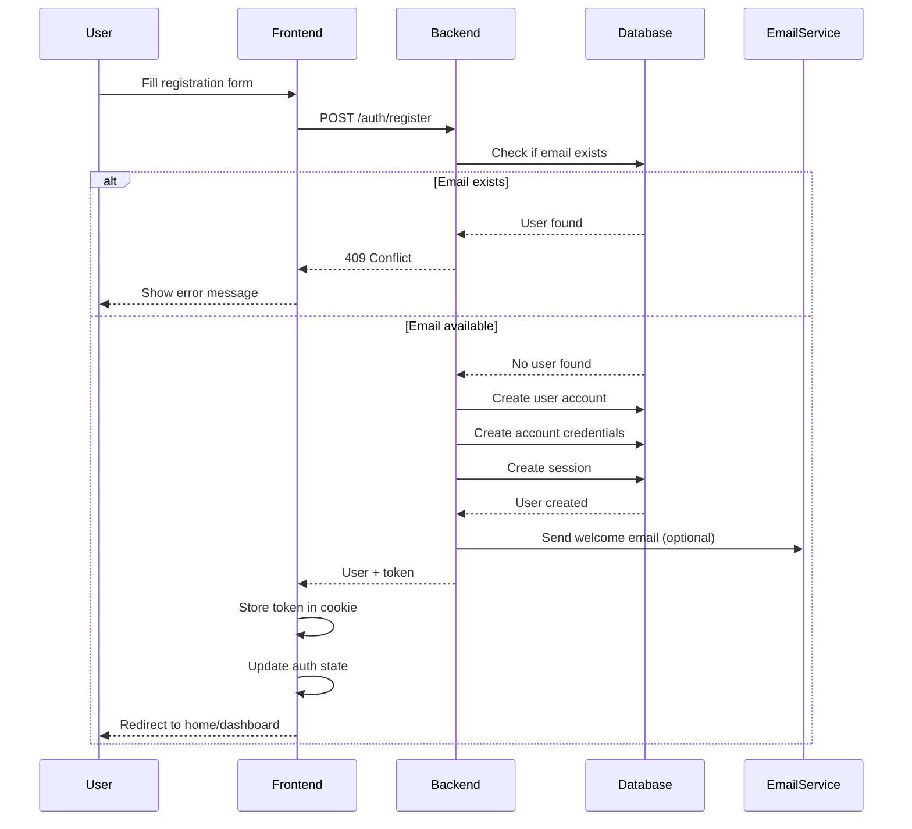
```mermaid
sequenceDiagram
    participant User
    participant Frontend
    participant Backend
    participant Database
    participant EmailService

    User->>Frontend: Fill registration form
    Frontend->>Backend: POST /auth/register
    Backend->>Database: Check if email exists
    alt Email exists
        Database-->>Backend: User found
        Backend-->>Frontend: 409 Conflict
        Frontend-->>User: Show error message
    else Email available
        Database-->>Backend: No user found
        Backend->>Database: Create user account
        Backend->>Database: Create account credentials
        Backend->>Database: Create session
        Database-->>Backend: User created
        Backend->>EmailService: Send welcome email (optional)
        Backend-->>Frontend: User + token
        Frontend->>Frontend: Store token in cookie
        Frontend->>Frontend: Update auth state
        Frontend-->>User: Redirect to home/dashboard
    end
```

### Login Flow

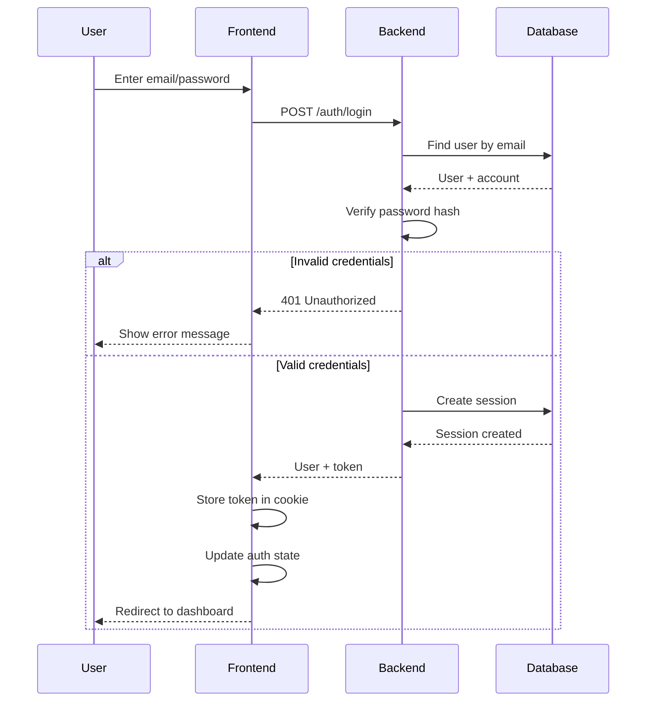
```mermaid
sequenceDiagram
    participant User
    participant Frontend
    participant Backend
    participant Database

    User->>Frontend: Enter email/password
    Frontend->>Backend: POST /auth/login
    Backend->>Database: Find user by email
    Database-->>Backend: User + account
    Backend->>Backend: Verify password hash
    alt Invalid credentials
        Backend-->>Frontend: 401 Unauthorized
        Frontend-->>User: Show error message
    else Valid credentials
        Backend->>Database: Create session
        Database-->>Backend: Session created
        Backend-->>Frontend: User + token
        Frontend->>Frontend: Store token in cookie
        Frontend->>Frontend: Update auth state
        Frontend-->>User: Redirect to dashboard
    end
```

### Password Reset Flow

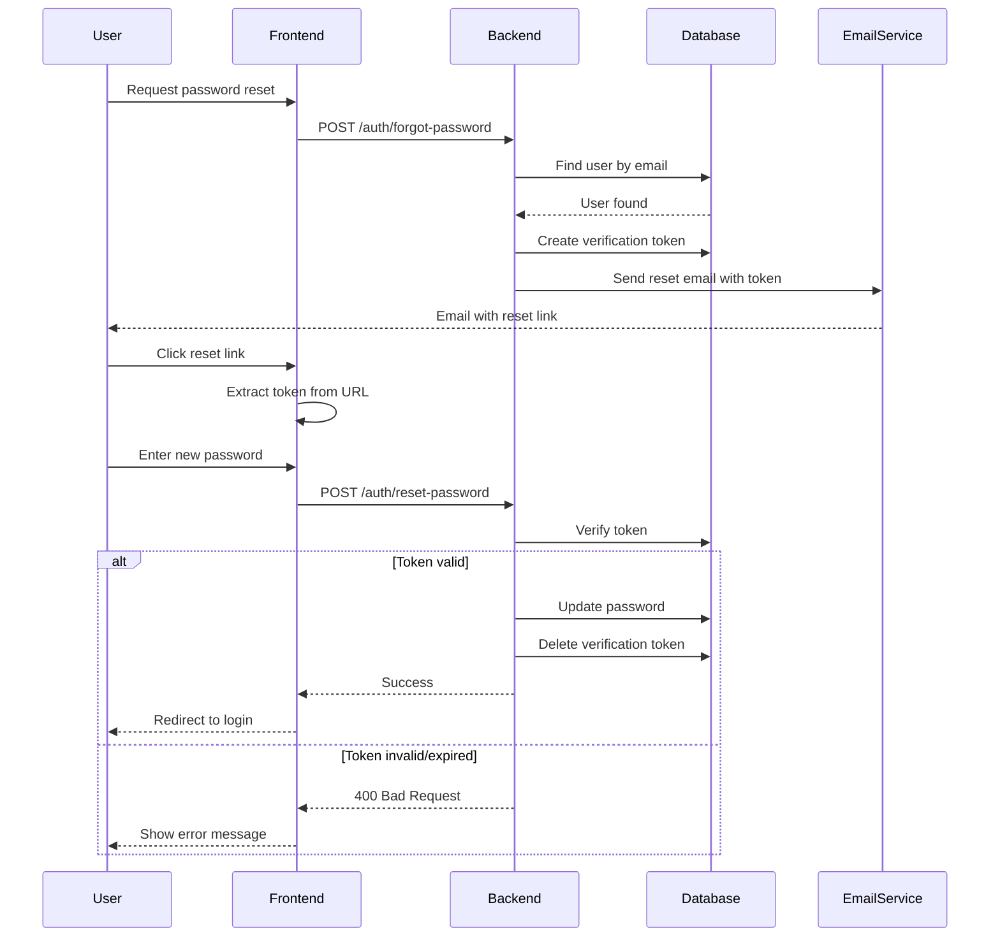
```mermaid
sequenceDiagram
    participant User
    participant Frontend
    participant Backend
    participant Database
    participant EmailService

    User->>Frontend: Request password reset
    Frontend->>Backend: POST /auth/forgot-password
    Backend->>Database: Find user by email
    Database-->>Backend: User found
    Backend->>Database: Create verification token
    Backend->>EmailService: Send reset email with token
    EmailService-->>User: Email with reset link
    User->>Frontend: Click reset link
    Frontend->>Frontend: Extract token from URL
    User->>Frontend: Enter new password
    Frontend->>Backend: POST /auth/reset-password
    Backend->>Database: Verify token
    alt Token valid
        Backend->>Database: Update password
        Backend->>Database: Delete verification token
        Backend-->>Frontend: Success
        Frontend-->>User: Redirect to login
    else Token invalid/expired
        Backend-->>Frontend: 400 Bad Request
        Frontend-->>User: Show error message
    end
```

### Session Management

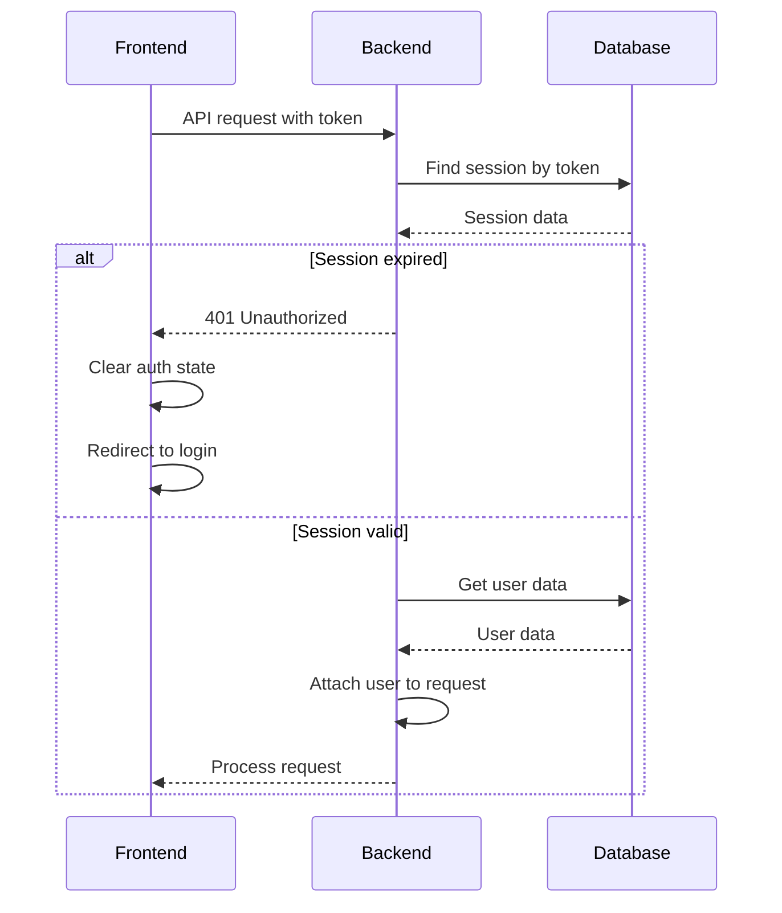
```mermaid
sequenceDiagram
    participant Frontend
    participant Backend
    participant Database

    Frontend->>Backend: API request with token
    Backend->>Database: Find session by token
    Database-->>Backend: Session data
    alt Session expired
        Backend-->>Frontend: 401 Unauthorized
        Frontend->>Frontend: Clear auth state
        Frontend->>Frontend: Redirect to login
    else Session valid
        Backend->>Database: Get user data
        Database-->>Backend: User data
        Backend->>Backend: Attach user to request
        Backend-->>Frontend: Process request
    end
```

---

## Shopping Flow

### Browse to Purchase Flow

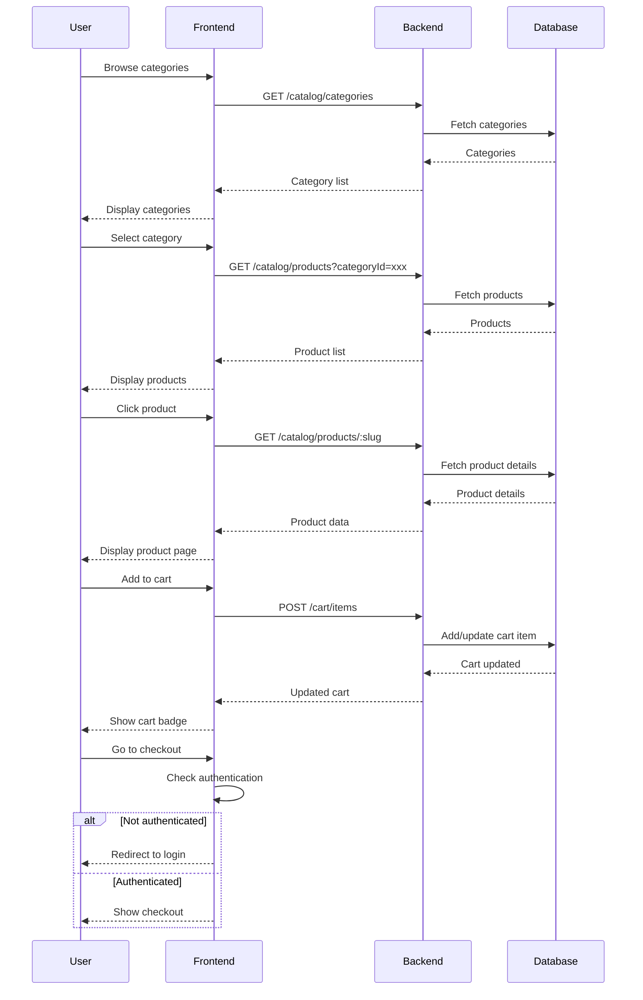
```mermaid
sequenceDiagram
    participant User
    participant Frontend
    participant Backend
    participant Database

    User->>Frontend: Browse categories
    Frontend->>Backend: GET /catalog/categories
    Backend->>Database: Fetch categories
    Database-->>Backend: Categories
    Backend-->>Frontend: Category list
    Frontend-->>User: Display categories
    
    User->>Frontend: Select category
    Frontend->>Backend: GET /catalog/products?categoryId=xxx
    Backend->>Database: Fetch products
    Database-->>Backend: Products
    Backend-->>Frontend: Product list
    Frontend-->>User: Display products
    
    User->>Frontend: Click product
    Frontend->>Backend: GET /catalog/products/:slug
    Backend->>Database: Fetch product details
    Database-->>Backend: Product details
    Backend-->>Frontend: Product data
    Frontend-->>User: Display product page
    
    User->>Frontend: Add to cart
    Frontend->>Backend: POST /cart/items
    Backend->>Database: Add/update cart item
    Database-->>Backend: Cart updated
    Backend-->>Frontend: Updated cart
    Frontend-->>User: Show cart badge
    
    User->>Frontend: Go to checkout
    Frontend->>Frontend: Check authentication
    alt Not authenticated
        Frontend-->>User: Redirect to login
    else Authenticated
        Frontend-->>User: Show checkout
    end
```

---

## Checkout Flow

### Complete Checkout Process

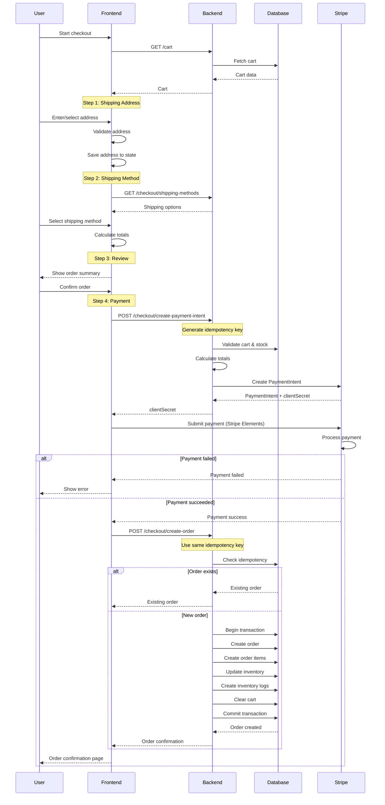
```mermaid
sequenceDiagram
    participant User
    participant Frontend
    participant Backend
    participant Database
    participant Stripe

    User->>Frontend: Start checkout
    Frontend->>Backend: GET /cart
    Backend->>Database: Fetch cart
    Database-->>Backend: Cart data
    Backend-->>Frontend: Cart
    
    Note over Frontend: Step 1: Shipping Address
    User->>Frontend: Enter/select address
    Frontend->>Frontend: Validate address
    Frontend->>Frontend: Save address to state
    
    Note over Frontend: Step 2: Shipping Method
    Frontend->>Backend: GET /checkout/shipping-methods
    Backend-->>Frontend: Shipping options
    User->>Frontend: Select shipping method
    Frontend->>Frontend: Calculate totals
    
    Note over Frontend: Step 3: Review
    Frontend-->>User: Show order summary
    User->>Frontend: Confirm order
    
    Note over Frontend: Step 4: Payment
    Frontend->>Backend: POST /checkout/create-payment-intent
    Note over Backend: Generate idempotency key
    Backend->>Database: Validate cart & stock
    Backend->>Backend: Calculate totals
    Backend->>Stripe: Create PaymentIntent
    Stripe-->>Backend: PaymentIntent + clientSecret
    Backend-->>Frontend: clientSecret
    
    Frontend->>Stripe: Submit payment (Stripe Elements)
    Stripe->>Stripe: Process payment
    alt Payment failed
        Stripe-->>Frontend: Payment failed
        Frontend-->>User: Show error
    else Payment succeeded
        Stripe-->>Frontend: Payment success
        Frontend->>Backend: POST /checkout/create-order
        Note over Backend: Use same idempotency key
        Backend->>Database: Check idempotency
        alt Order exists
            Database-->>Backend: Existing order
            Backend-->>Frontend: Existing order
        else New order
            Backend->>Database: Begin transaction
            Backend->>Database: Create order
            Backend->>Database: Create order items
            Backend->>Database: Update inventory
            Backend->>Database: Create inventory logs
            Backend->>Database: Clear cart
            Backend->>Database: Commit transaction
            Database-->>Backend: Order created
            Backend-->>Frontend: Order confirmation
        end
        Frontend-->>User: Order confirmation page
    end
```

### Payment Webhook Flow

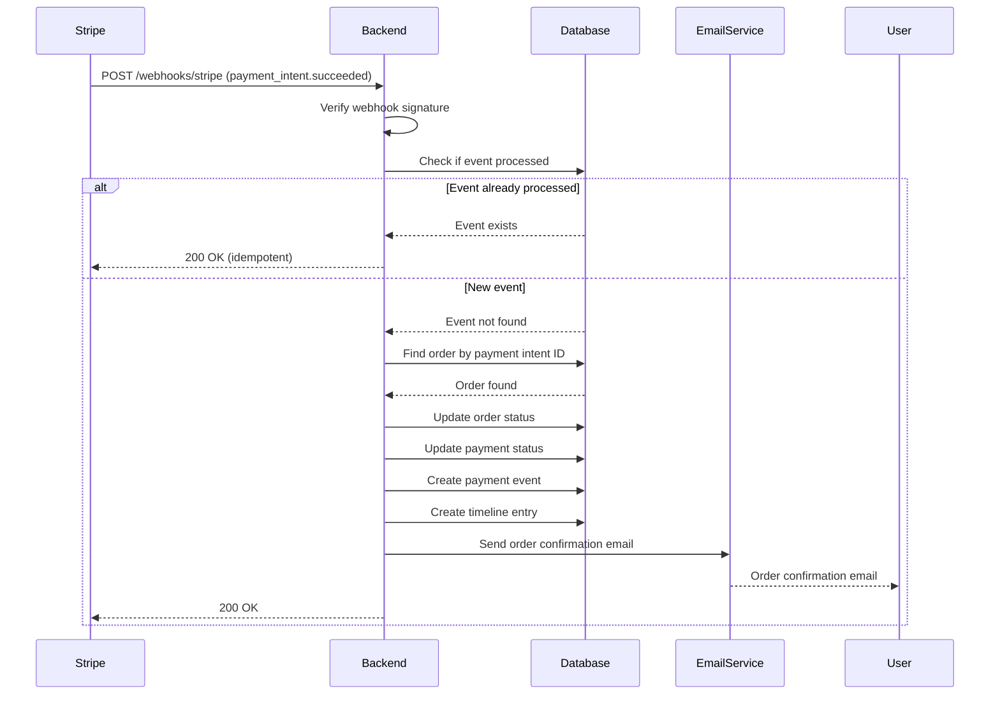
```mermaid
sequenceDiagram
    participant Stripe
    participant Backend
    participant Database
    participant EmailService

    Stripe->>Backend: POST /webhooks/stripe (payment_intent.succeeded)
    Backend->>Backend: Verify webhook signature
    Backend->>Database: Check if event processed
    alt Event already processed
        Database-->>Backend: Event exists
        Backend-->>Stripe: 200 OK (idempotent)
    else New event
        Database-->>Backend: Event not found
        Backend->>Database: Find order by payment intent ID
        Database-->>Backend: Order found
        Backend->>Database: Update order status
        Backend->>Database: Update payment status
        Backend->>Database: Create payment event
        Backend->>Database: Create timeline entry
        Backend->>EmailService: Send order confirmation email
        EmailService-->>User: Order confirmation email
        Backend-->>Stripe: 200 OK
    end
```

---

## Order Fulfillment Flow

### Order Processing Workflow

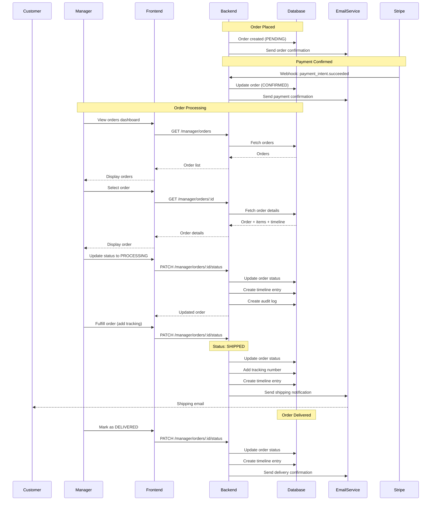
```mermaid
sequenceDiagram
    participant Customer
    participant Manager
    participant Frontend
    participant Backend
    participant Database
    participant EmailService

    Note over Backend,Database: Order Placed
    Backend->>Database: Order created (PENDING)
    Backend->>EmailService: Send order confirmation
    
    Note over Stripe,Backend: Payment Confirmed
    Stripe->>Backend: Webhook: payment_intent.succeeded
    Backend->>Database: Update order (CONFIRMED)
    Backend->>EmailService: Send payment confirmation
    
    Note over Manager,Database: Order Processing
    Manager->>Frontend: View orders dashboard
    Frontend->>Backend: GET /manager/orders
    Backend->>Database: Fetch orders
    Database-->>Backend: Orders
    Backend-->>Frontend: Order list
    Frontend-->>Manager: Display orders
    
    Manager->>Frontend: Select order
    Frontend->>Backend: GET /manager/orders/:id
    Backend->>Database: Fetch order details
    Database-->>Backend: Order + items + timeline
    Backend-->>Frontend: Order details
    Frontend-->>Manager: Display order
    
    Manager->>Frontend: Update status to PROCESSING
    Frontend->>Backend: PATCH /manager/orders/:id/status
    Backend->>Database: Update order status
    Backend->>Database: Create timeline entry
    Backend->>Database: Create audit log
    Backend-->>Frontend: Updated order
    
    Manager->>Frontend: Fulfill order (add tracking)
    Frontend->>Backend: PATCH /manager/orders/:id/status
    Note over Backend: Status: SHIPPED
    Backend->>Database: Update order status
    Backend->>Database: Add tracking number
    Backend->>Database: Create timeline entry
    Backend->>EmailService: Send shipping notification
    EmailService-->>Customer: Shipping email
    
    Note over Database: Order Delivered
    Manager->>Frontend: Mark as DELIVERED
    Frontend->>Backend: PATCH /manager/orders/:id/status
    Backend->>Database: Update order status
    Backend->>Database: Create timeline entry
    Backend->>EmailService: Send delivery confirmation
```

### Order Cancellation Flow

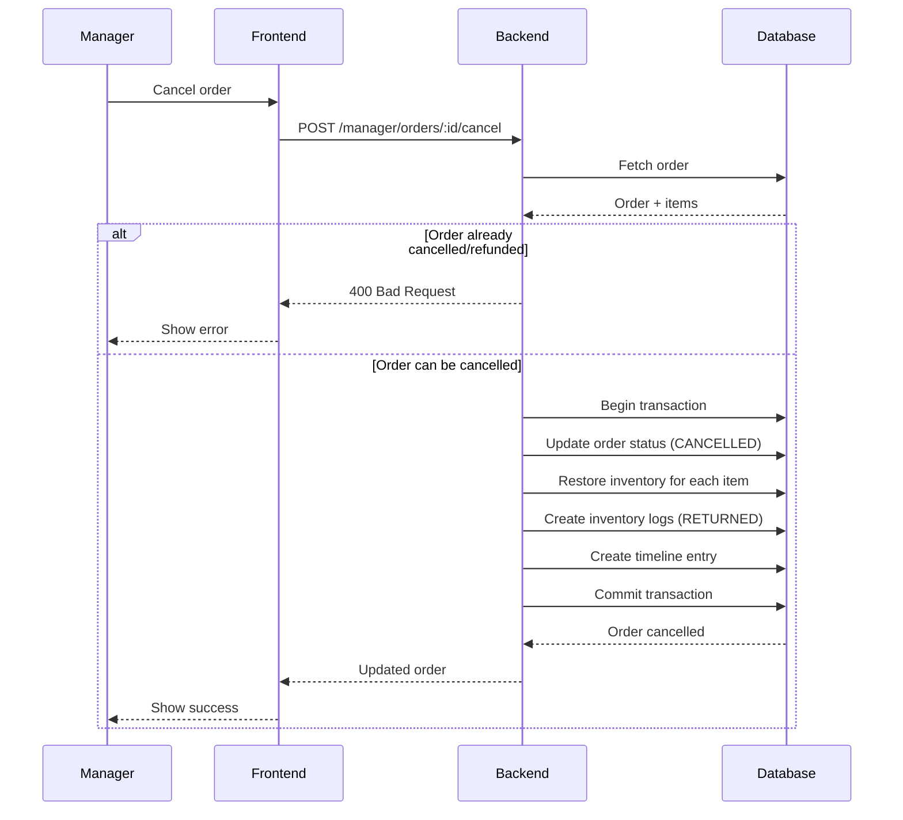
```mermaid
sequenceDiagram
    participant Manager
    participant Frontend
    participant Backend
    participant Database

    Manager->>Frontend: Cancel order
    Frontend->>Backend: POST /manager/orders/:id/cancel
    Backend->>Database: Fetch order
    Database-->>Backend: Order + items
    
    alt Order already cancelled/refunded
        Backend-->>Frontend: 400 Bad Request
        Frontend-->>Manager: Show error
    else Order can be cancelled
        Backend->>Database: Begin transaction
        Backend->>Database: Update order status (CANCELLED)
        Backend->>Database: Restore inventory for each item
        Backend->>Database: Create inventory logs (RETURNED)
        Backend->>Database: Create timeline entry
        Backend->>Database: Commit transaction
        Database-->>Backend: Order cancelled
        Backend-->>Frontend: Updated order
        Frontend-->>Manager: Show success
    end
```

---

## Inventory Management Flow

### Inventory Adjustment Flow

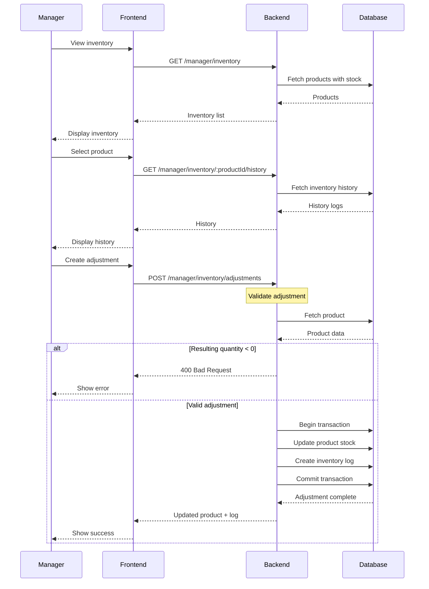
```mermaid
sequenceDiagram
    participant Manager
    participant Frontend
    participant Backend
    participant Database

    Manager->>Frontend: View inventory
    Frontend->>Backend: GET /manager/inventory
    Backend->>Database: Fetch products with stock
    Database-->>Backend: Products
    Backend-->>Frontend: Inventory list
    Frontend-->>Manager: Display inventory
    
    Manager->>Frontend: Select product
    Frontend->>Backend: GET /manager/inventory/:productId/history
    Backend->>Database: Fetch inventory history
    Database-->>Backend: History logs
    Backend-->>Frontend: History
    Frontend-->>Manager: Display history
    
    Manager->>Frontend: Create adjustment
    Frontend->>Backend: POST /manager/inventory/adjustments
    Note over Backend: Validate adjustment
    Backend->>Database: Fetch product
    Database-->>Backend: Product data
    
    alt Resulting quantity < 0
        Backend-->>Frontend: 400 Bad Request
        Frontend-->>Manager: Show error
    else Valid adjustment
        Backend->>Database: Begin transaction
        Backend->>Database: Update product stock
        Backend->>Database: Create inventory log
        Backend->>Database: Commit transaction
        Database-->>Backend: Adjustment complete
        Backend-->>Frontend: Updated product + log
        Frontend-->>Manager: Show success
    end
```

### Low Stock Alert Flow

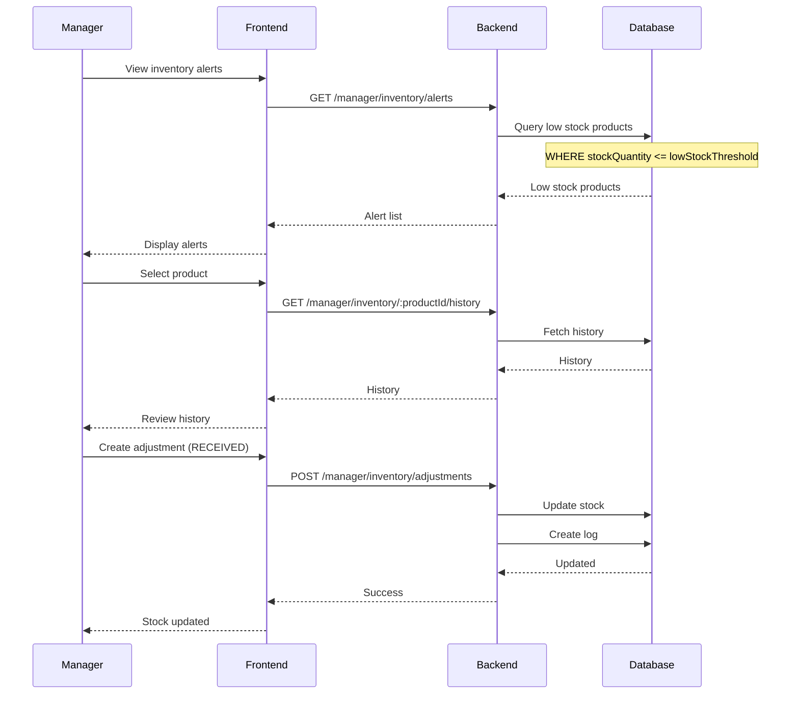
```mermaid
sequenceDiagram
    participant Manager
    participant Frontend
    participant Backend
    participant Database

    Manager->>Frontend: View inventory alerts
    Frontend->>Backend: GET /manager/inventory/alerts
    Backend->>Database: Query low stock products
    Note over Database: WHERE stockQuantity <= lowStockThreshold
    Database-->>Backend: Low stock products
    Backend-->>Frontend: Alert list
    Frontend-->>Manager: Display alerts
    
    Manager->>Frontend: Select product
    Frontend->>Backend: GET /manager/inventory/:productId/history
    Backend->>Database: Fetch history
    Database-->>Backend: History
    Backend-->>Frontend: History
    Frontend-->>Manager: Review history
    
    Manager->>Frontend: Create adjustment (RECEIVED)
    Frontend->>Backend: POST /manager/inventory/adjustments
    Backend->>Database: Update stock
    Backend->>Database: Create log
    Database-->>Backend: Updated
    Backend-->>Frontend: Success
    Frontend-->>Manager: Stock updated
```

---

## Admin Workflow

### User Management Flow

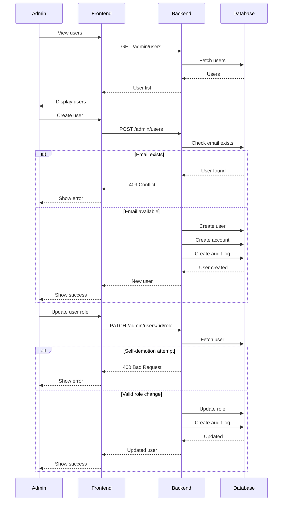
```mermaid
sequenceDiagram
    participant Admin
    participant Frontend
    participant Backend
    participant Database

    Admin->>Frontend: View users
    Frontend->>Backend: GET /admin/users
    Backend->>Database: Fetch users
    Database-->>Backend: Users
    Backend-->>Frontend: User list
    Frontend-->>Admin: Display users
    
    Admin->>Frontend: Create user
    Frontend->>Backend: POST /admin/users
    Backend->>Database: Check email exists
    alt Email exists
        Database-->>Backend: User found
        Backend-->>Frontend: 409 Conflict
        Frontend-->>Admin: Show error
    else Email available
        Backend->>Database: Create user
        Backend->>Database: Create account
        Backend->>Database: Create audit log
        Database-->>Backend: User created
        Backend-->>Frontend: New user
        Frontend-->>Admin: Show success
    end
    
    Admin->>Frontend: Update user role
    Frontend->>Backend: PATCH /admin/users/:id/role
    Backend->>Database: Fetch user
    alt Self-demotion attempt
        Backend-->>Frontend: 400 Bad Request
        Frontend-->>Admin: Show error
    else Valid role change
        Backend->>Database: Update role
        Backend->>Database: Create audit log
        Database-->>Backend: Updated
        Backend-->>Frontend: Updated user
        Frontend-->>Admin: Show success
    end
```

### Settings Management Flow

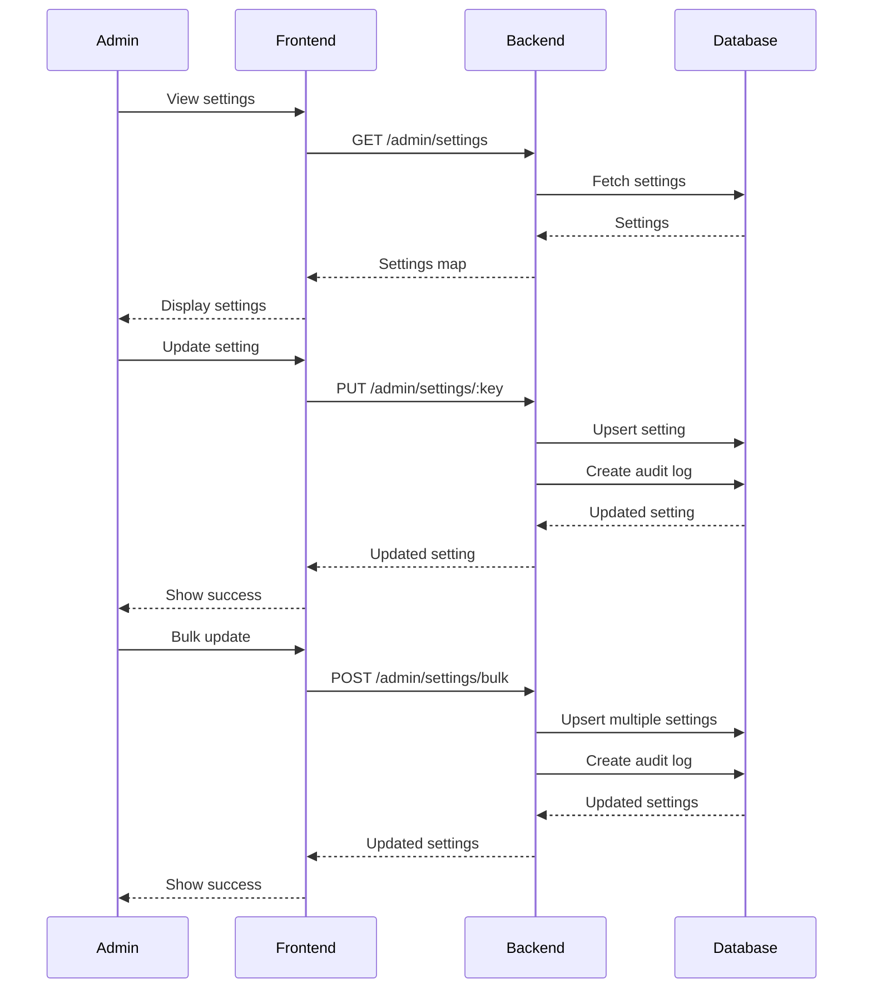
```mermaid
sequenceDiagram
    participant Admin
    participant Frontend
    participant Backend
    participant Database

    Admin->>Frontend: View settings
    Frontend->>Backend: GET /admin/settings
    Backend->>Database: Fetch settings
    Database-->>Backend: Settings
    Backend-->>Frontend: Settings map
    Frontend-->>Admin: Display settings
    
    Admin->>Frontend: Update setting
    Frontend->>Backend: PUT /admin/settings/:key
    Backend->>Database: Upsert setting
    Backend->>Database: Create audit log
    Database-->>Backend: Updated setting
    Backend-->>Frontend: Updated setting
    Frontend-->>Admin: Show success
    
    Admin->>Frontend: Bulk update
    Frontend->>Backend: POST /admin/settings/bulk
    Backend->>Database: Upsert multiple settings
    Backend->>Database: Create audit log
    Database-->>Backend: Updated settings
    Backend-->>Frontend: Updated settings
    Frontend-->>Admin: Show success
```

---

## Data Flow Summary

### Request Processing Flow

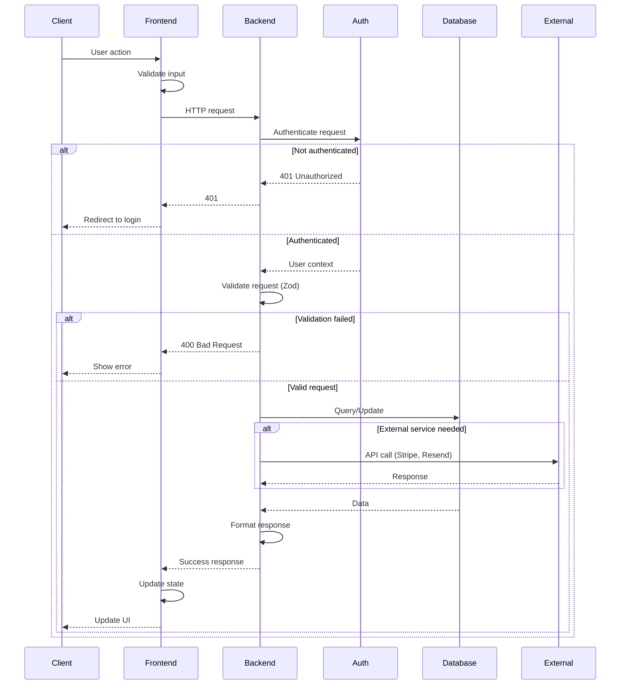
```mermaid
sequenceDiagram
    participant Client
    participant Frontend
    participant Backend
    participant Auth
    participant Database
    participant External

    Client->>Frontend: User action
    Frontend->>Frontend: Validate input
    Frontend->>Backend: HTTP request
    
    Backend->>Auth: Authenticate request
    alt Not authenticated
        Auth-->>Backend: 401 Unauthorized
        Backend-->>Frontend: 401
        Frontend-->>Client: Redirect to login
    else Authenticated
        Auth-->>Backend: User context
        Backend->>Backend: Validate request (Zod)
        alt Validation failed
            Backend-->>Frontend: 400 Bad Request
            Frontend-->>Client: Show error
        else Valid request
            Backend->>Database: Query/Update
            alt External service needed
                Backend->>External: API call (Stripe, Resend)
                External-->>Backend: Response
            end
            Database-->>Backend: Data
            Backend->>Backend: Format response
            Backend-->>Frontend: Success response
            Frontend->>Frontend: Update state
            Frontend-->>Client: Update UI
        end
    end
```

---

**Next:** [07. Architecture](07-architecture.md) | [Back to Index](README.md)

