# 07. Architecture Documentation

This document describes the system architecture, frontend/backend structure, and data flow patterns.

## System Architecture

### High-Level Architecture

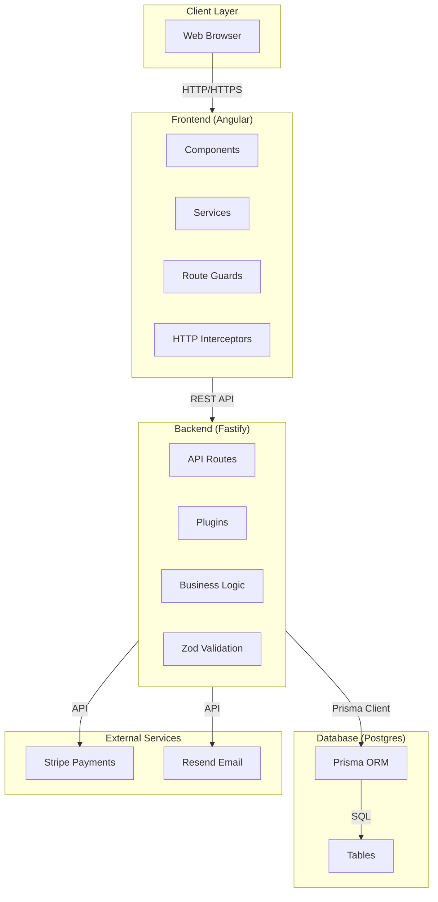

### Component Interaction

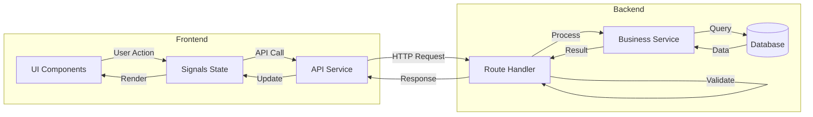

---

## Frontend Architecture

### Component Structure

```
frontend/src/app/
├── core/                          # Core functionality
│   ├── constants/                # Constants
│   ├── content/                  # Centralized text content
│   ├── guards/                   # Route guards
│   │   ├── auth.guard.ts
│   │   └── role.guard.ts
│   ├── interceptors/            # HTTP interceptors
│   │   ├── auth.interceptor.ts
│   │   └── error.interceptor.ts
│   ├── models/                   # TypeScript interfaces
│   │   ├── api.types.ts
│   │   ├── product.model.ts
│   │   ├── cart.model.ts
│   │   └── ...
│   └── services/                 # API services
│       ├── api.service.ts        # Base HTTP service
│       ├── auth.service.ts
│       ├── catalog.service.ts
│       ├── cart.service.ts
│       ├── checkout.service.ts
│       ├── order.service.ts
│       ├── admin.service.ts
│       └── mock-data.service.ts  # Mock data adapter
│
├── features/                     # Feature modules
│   ├── home/
│   ├── catalog/
│   │   ├── category-listing/
│   │   ├── product-listing/
│   │   └── product-detail/
│   ├── cart/
│   ├── checkout/
│   │   ├── checkout-address/
│   │   ├── checkout-shipping/
│   │   ├── checkout-review/
│   │   ├── checkout-payment/
│   │   └── checkout-confirmation/
│   ├── orders/
│   ├── account/
│   │   ├── profile/
│   │   └── addresses/
│   ├── auth/
│   │   ├── login/
│   │   ├── register/
│   │   ├── forgot-password/
│   │   └── reset-password/
│   ├── manager/
│   │   ├── orders-dashboard/
│   │   ├── order-detail/
│   │   ├── inventory-list/
│   │   └── inventory-adjustments/
│   └── admin/
│       ├── users-management/
│       ├── settings-management/
│       └── audit-logs/
│
└── shared/                       # Shared components
    ├── components/
    └── layouts/
```

### Frontend Data Flow

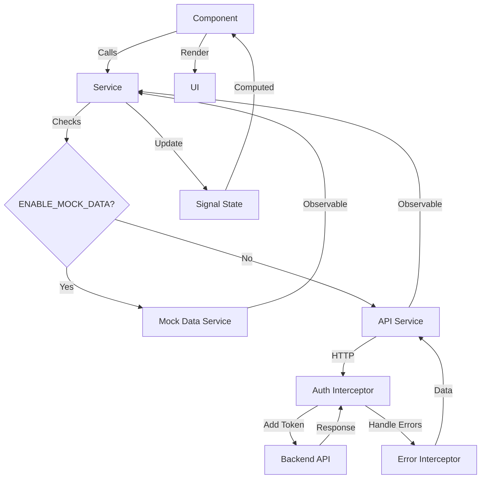

### State Management Pattern

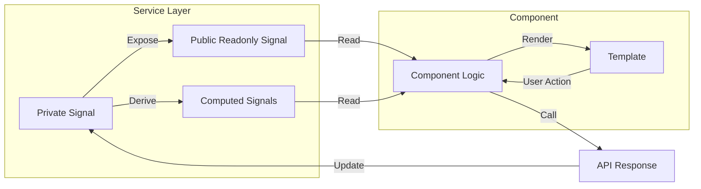

**Example:**
```typescript
// Service
private cartState = signal<Cart | null>(null);
readonly cart = this.cartState.asReadonly();
readonly itemCount = computed(() => this.cartState()?.itemCount ?? 0);

// Component
readonly cart = this.cartService.cart;
readonly itemCount = this.cartService.itemCount;
```

---

## Backend Architecture

### Route Organization

```
backend/src/
├── index.ts                      # Application entry
├── config/                       # Configuration
│   └── index.ts
├── plugins/                      # Fastify plugins
│   ├── auth.ts                  # Authentication plugin
│   ├── prisma.ts                # Prisma plugin
│   └── error-handler.ts         # Error handling
├── routes/                       # API routes
│   ├── public/                  # Public routes
│   │   ├── index.ts
│   │   ├── catalog.ts
│   │   └── auth.ts
│   ├── customer/                # Customer routes
│   │   ├── index.ts
│   │   ├── cart.ts
│   │   ├── checkout.ts
│   │   ├── orders.ts
│   │   └── profile.ts
│   ├── manager/                 # Manager routes
│   │   ├── index.ts
│   │   ├── orders.ts
│   │   ├── inventory.ts
│   │   └── products.ts
│   └── admin/                   # Admin routes
│       ├── index.ts
│       ├── users.ts
│       ├── settings.ts
│       └── audit.ts
├── schemas/                      # Zod validation schemas
│   └── index.ts
└── services/                     # Business logic services
    └── email.ts
```

### Backend Request Flow

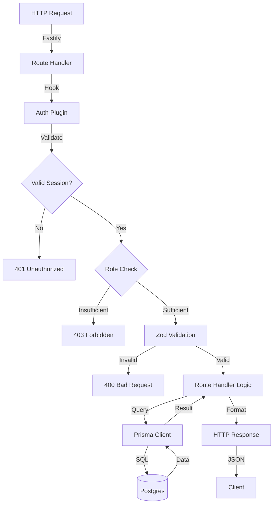

### Plugin System

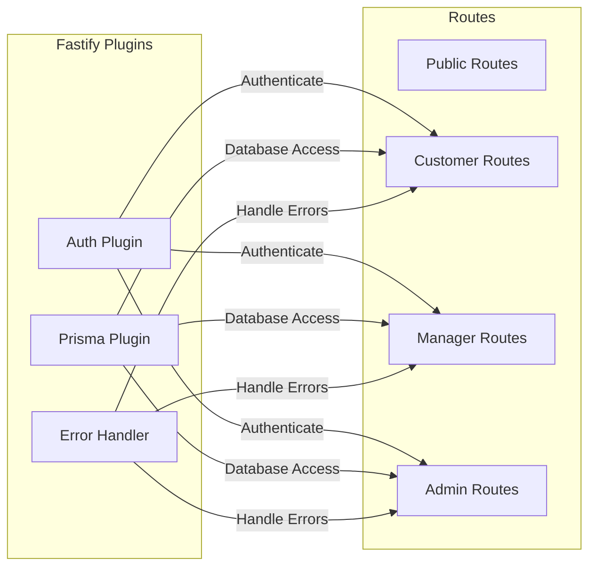

---

## Data Flow Patterns

### Read Operation Flow

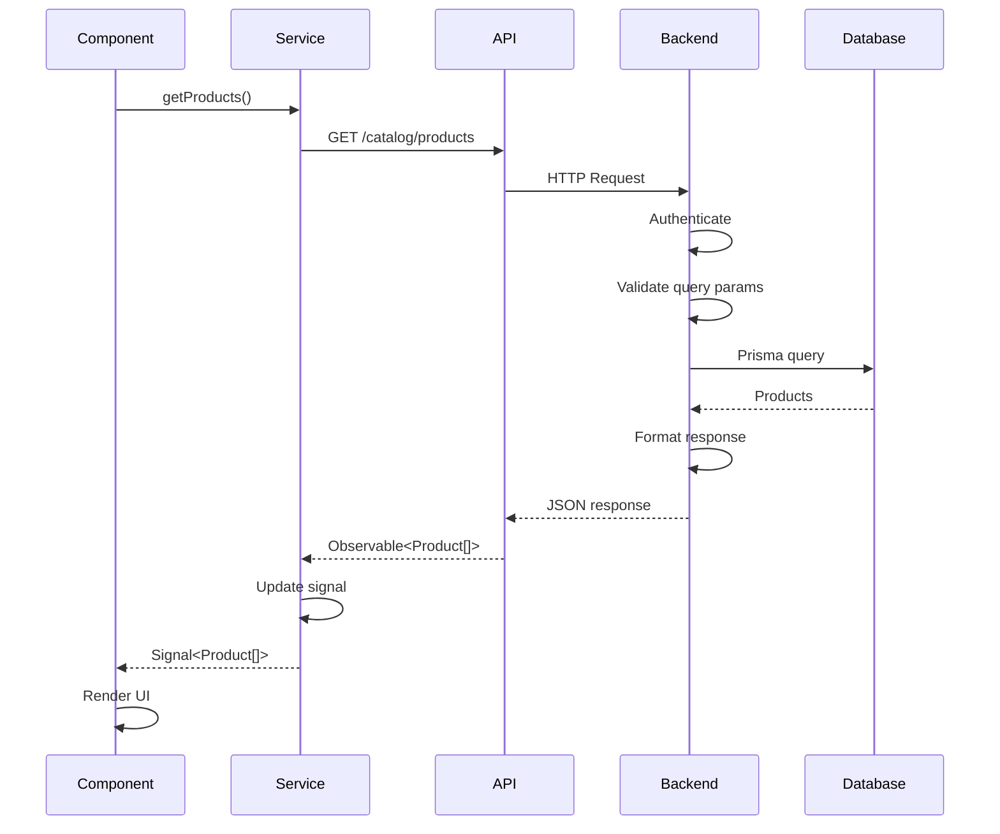

### Write Operation Flow

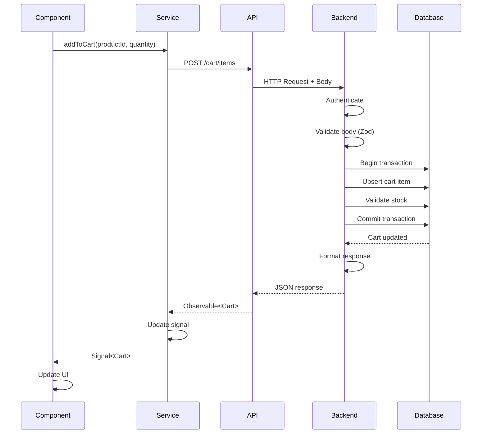

### Transaction Flow (Order Creation)

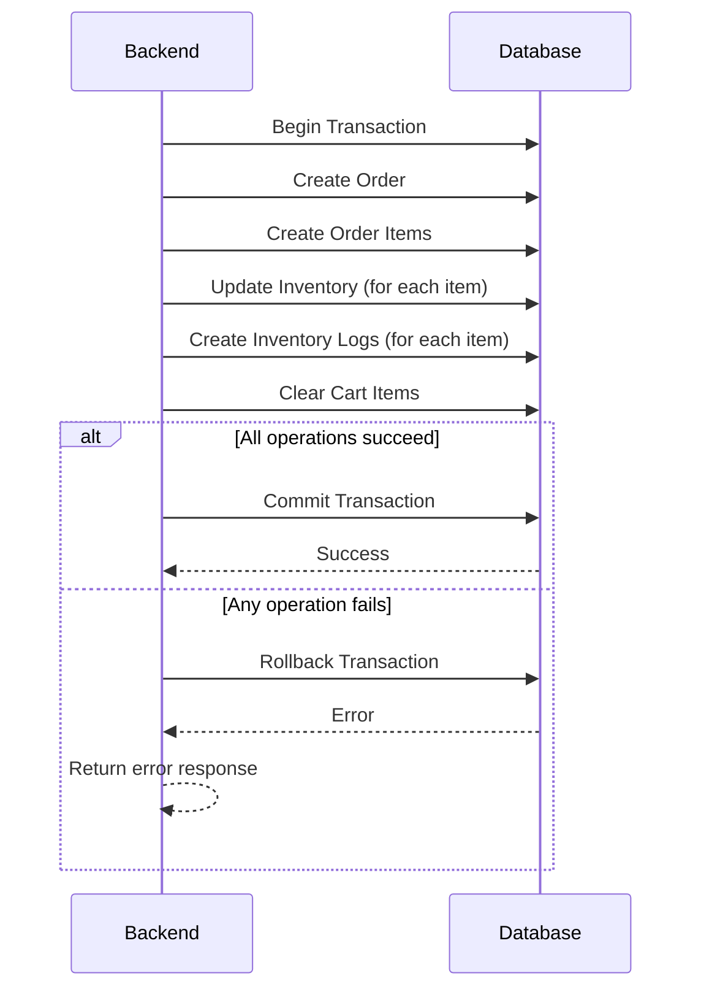

---

## Authentication Flow

### Session-Based Authentication

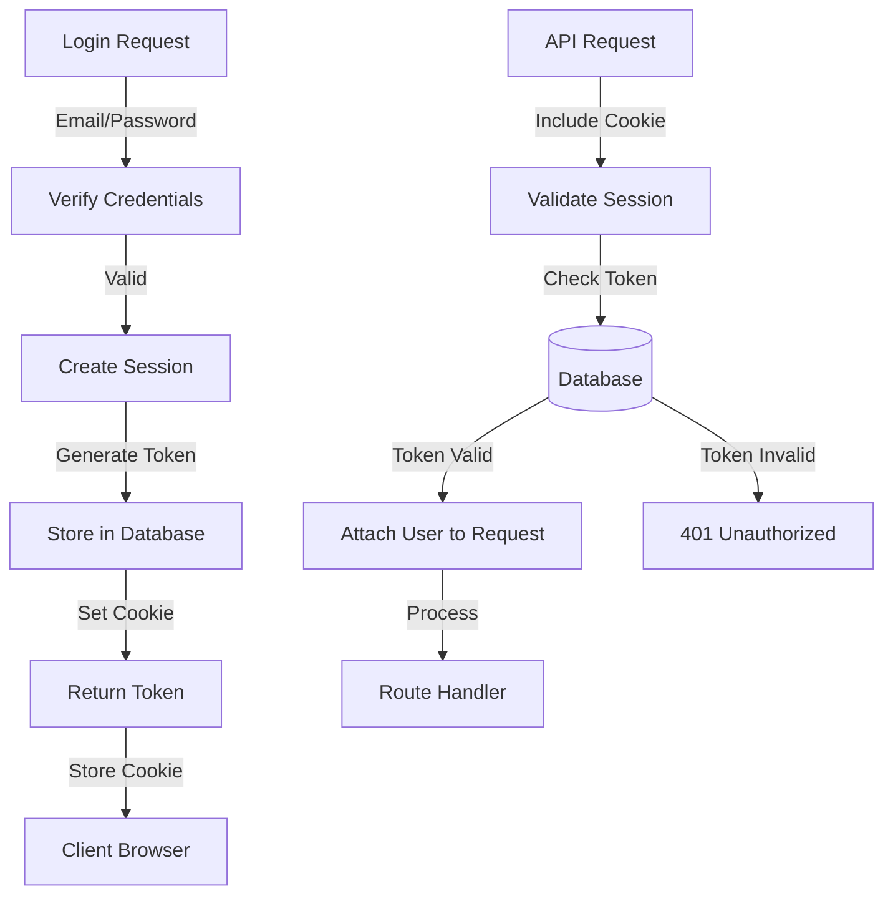

### Authorization Flow

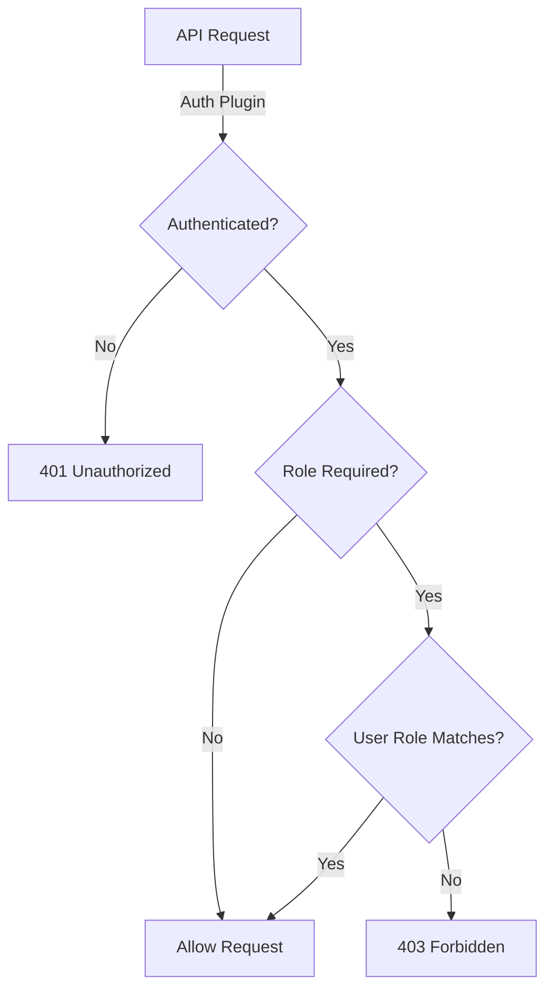

---

## Payment Processing Flow

### Stripe Integration

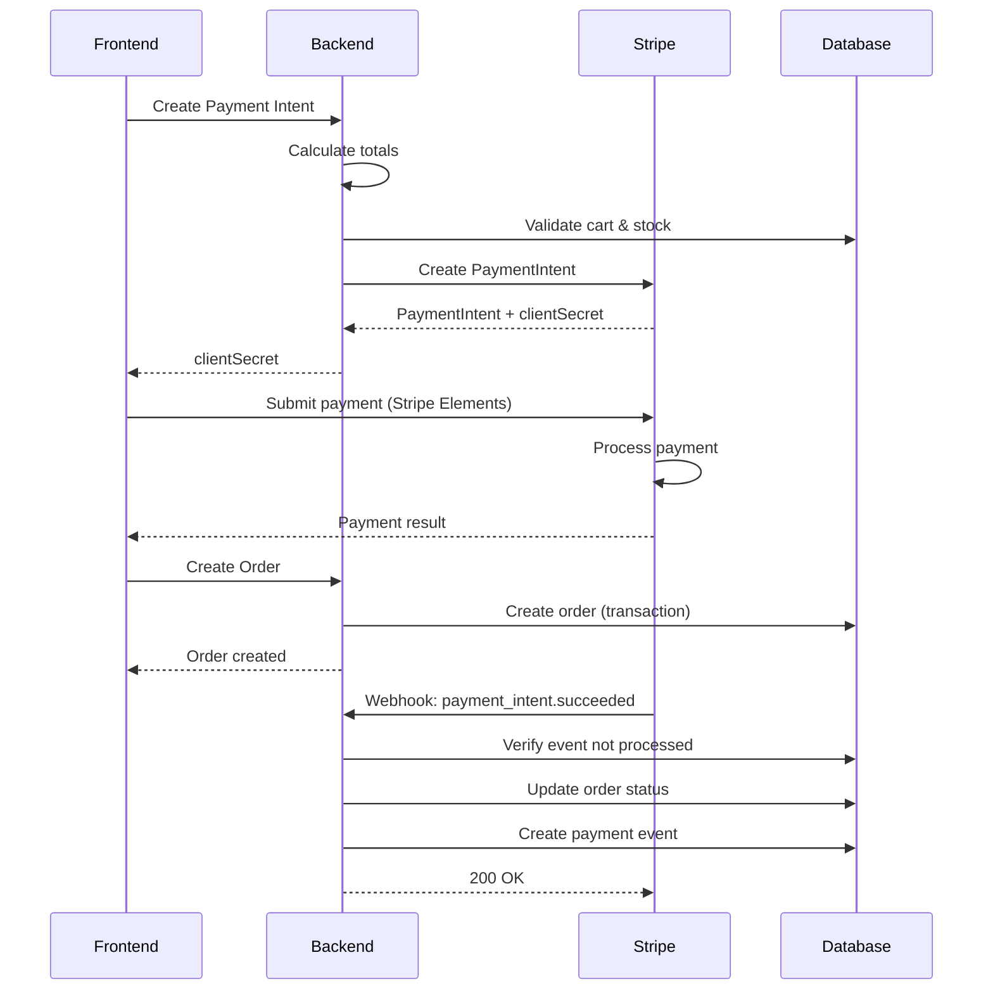

---

## Error Handling Flow

### Frontend Error Handling

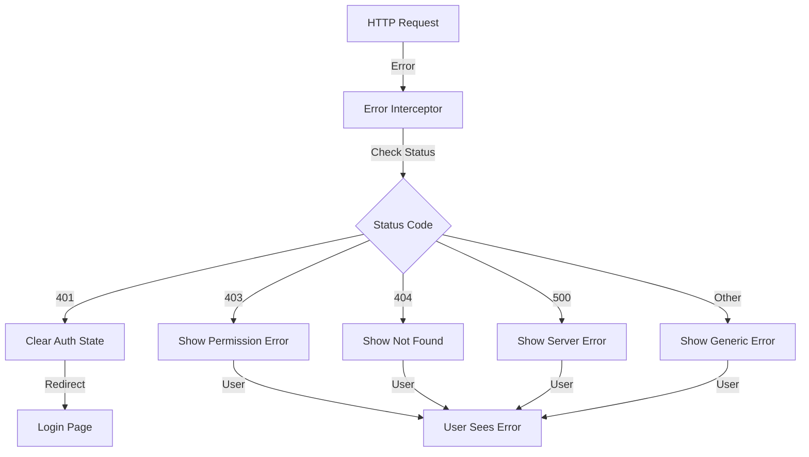

### Backend Error Handling

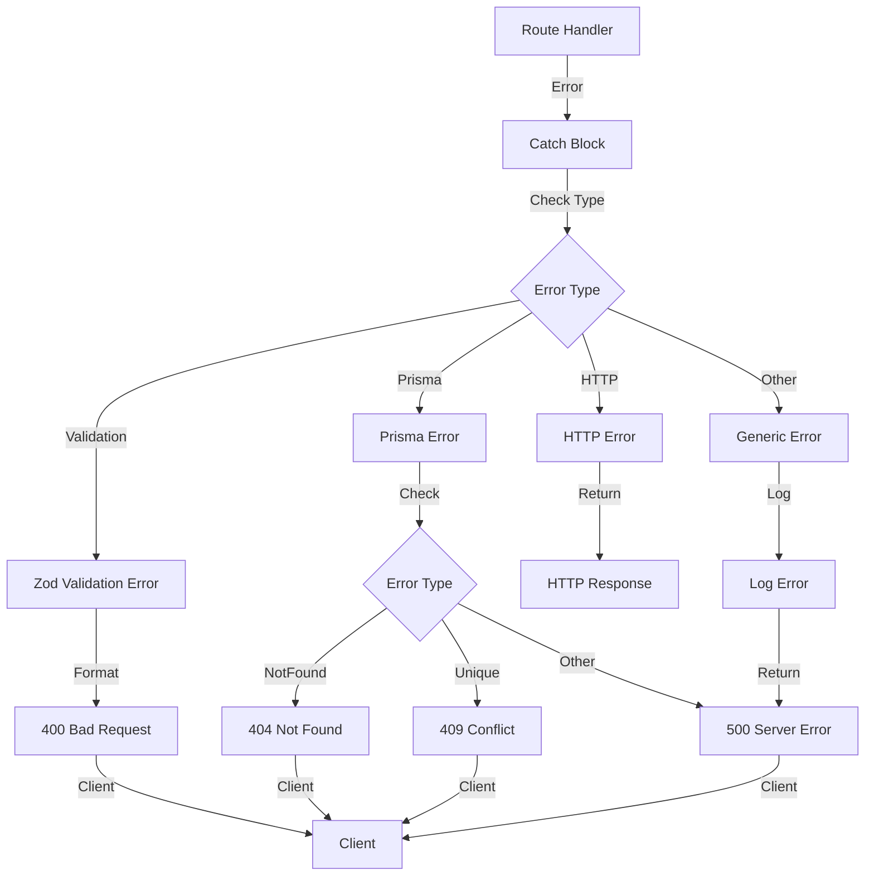

---

## Database Access Pattern

### Prisma Query Pattern

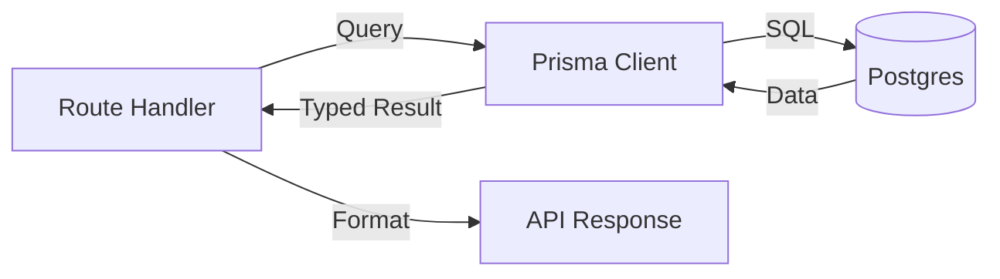

**Example:**
```typescript
// Route handler
const products = await fastify.prisma.product.findMany({
  where: { isActive: true },
  include: { category: true, brand: true },
  orderBy: { createdAt: 'desc' },
  skip: (page - 1) * limit,
  take: limit,
});
```

---

## Module Boundaries

### Clear Separation

```
┌─────────────────────────────────────────┐
│         Frontend (Angular)              │
│  ┌──────────┐  ┌──────────┐            │
│  │ Features │  │ Services │            │
│  └──────────┘  └──────────┘            │
│       │              │                  │
│       └──────┬───────┘                  │
│              │                          │
│         ┌────▼────┐                      │
│         │   API   │                      │
│         └────┬────┘                      │
└──────────────┼───────────────────────────┘
               │ HTTP/REST
┌──────────────┼───────────────────────────┐
│         ┌────▼────┐                      │
│         │ Routes  │                      │
│         └────┬────┘                      │
│              │                          │
│  ┌───────────┼───────────┐              │
│  │           │           │              │
│  ┌─▼──┐  ┌───▼───┐  ┌───▼──┐            │
│  │Auth│  │Plugin │  │Service│            │
│  └────┘  └───────┘  └──────┘            │
│              │                          │
│         ┌────▼────┐                      │
│         │ Prisma  │                      │
│         └────┬────┘                      │
└──────────────┼───────────────────────────┘
               │ SQL
┌──────────────┼───────────────────────────┐
│         ┌────▼────┐                      │
│         │ Postgres│                      │
│         └─────────┘                      │
└──────────────────────────────────────────┘
```

---

## Scalability Considerations

### Current Architecture

- **Monolith Backend:** Single Fastify application
- **Standalone Frontend:** Single Angular application
- **Database:** Single Postgres database

### Future Scalability Options

1. **Horizontal Scaling:**
   - Multiple backend instances behind load balancer
   - Stateless sessions (database-backed)
   - Shared database

2. **Database Optimization:**
   - Read replicas for read-heavy operations
   - Connection pooling
   - Query optimization

3. **Caching Layer:**
   - Redis for session storage
   - Cache frequently accessed data
   - CDN for static assets

4. **Microservices (if needed):**
   - Separate payment service
   - Separate email service
   - Separate inventory service

---

**Next:** [08. Frontend Guide](08-frontend-guide.md) | [Back to Index](README.md)

